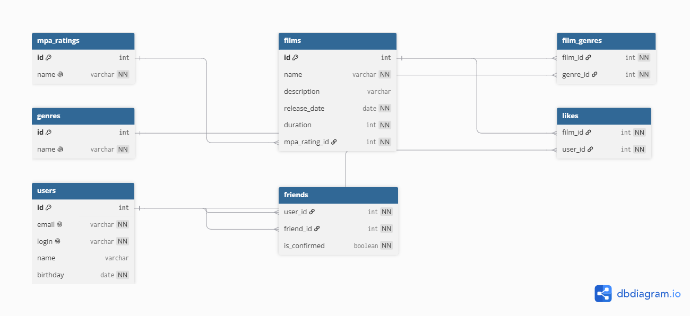

# Схема базы данных Filmorate

Хранит информацию о фильмах, пользователях, лайках и друзьях в актуальном состоянии.

## ER-диаграмма



## Описание связей между таблицами

1. От **mpa_ratings** к **films** - у одного рейтинга MPA может быть много фильмов.
2. От **films** к **film_genres** - у одного фильма может быть много жанров.
3. От **genres** к **film_genres** - один жанр может быть у многих фильмов.
4. От **films** к **likes** - у одного фильма может быть много лайков.
5. От **users** к **likes** - один пользователь может поставить много лайков.
6. От **users** к **friends** (отправитель) - один пользователь может отправить много заявок в друзья.
7. От **users** к **friends** (получатель) - одному пользователю может прийти many заявок в друзья.

## Описание таблиц
* **films** и **users** - основные таблицы с данными
* **mpa_ratings** и **genres** - справочники для исключения дублирования названий
* **film_genres**, **likes** и **friends** - промежуточные таблицы для связей

## Примеры основных SQL-запросов

### Получение всех фильмов с их рейтингом MPA
```sql
SELECT f.name, f.description, m.name AS mpa
FROM films f
JOIN mpa_ratings m ON f.mpa_rating_id = m.id;
```

### Топ-10 самых популярных фильмов (по количеству лайков)
```sql
SELECT f.name, COUNT(l.user_id) AS rate
FROM films f
LEFT JOIN likes l ON f.id = l.film_id
GROUP BY f.id
ORDER BY rate DESC
LIMIT 10;
```

### Получение списка друзей пользователя (например, с id = 1)
```sql
SELECT u.name, u.login
FROM friends f
JOIN users u ON f.friend_id = u.id
WHERE f.user_id = 1;
```

### Поиск общих друзей у двух пользователей (с id = 1 и id = 2)
```sql
SELECT u.name 
FROM users u
JOIN friends f1 ON u.id = f1.friend_id AND f1.user_id = 1
JOIN friends f2 ON u.id = f2.friend_id AND f2.user_id = 2;
```